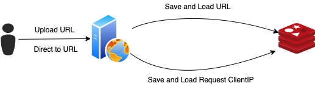

# url-shortener
URL shortener using Go programming.

## System Design



實現一個簡易的 url-shortener 系統，透過一個 Http server 接收 URL Upload 的請求，並回傳提供一個 URL shortener，內部主要的組成元件為：
- Http server
- Redis storage

### API

#### 取得 ShortURL, POST /api/v1/urls

##### Request Body

- url: 需要進行 url-shortener 的原 URL
- expireAt: 過期時間

```json
{
    "url": "https://www.google.com",
    "expireAt": "2021-07-18T16:58:30+08:00" 
}
```

##### Response Body

- id: short URL ID
- shortUrl: shortUrl

```json
{
  "id": "aHR0cHM6Ly93d3cuZ29vZ2xlLmNvbTIwMjEtMDctMThUMTY6NTg6MzArMDg6MDA=",
  "shortUrl": "http://localhost:8080/aHR0cHM6Ly93d3cuZ29vZ2xlLmNvbTIwMjEtMDctMThUMTY6NTg6MzArMDg6MDA="
}
```

##### Error 處理

- 檢查 ClientIP 是否被已達上傳上限
- 參數不可為空
- expireAt 不可小於當前時間

#### 透過 ShortURL 導轉至原 URL, GET /{urlID}

##### Request Path Param

- urlID: shortUrl ID

##### Error 處理

- 查無此 urlID 回傳 404
- urlID 不可為空

### 設計構思及其他場景處理

- 資料的儲存選擇了使用 Redis，原因是考慮到資料是有時效性的，認為透過 Redis 提供的儲存機制(expireAt)可以有效的達成需求。但認為在使用上需要注意 Redis 在儲存的場景若無額外設定其實為非持久化，若後續優化也可能會考慮使用 MySQL 來儲存並可透過排程服務來達到時效性的判斷，甚至是其他場景的保證
- 在取得 ShortURL 時考慮了因無 auth 驗證機制，所以目前有提供透過取得並驗證 client IP 來避免 ddos 攻擊
    - 實作取 client IP 並將其儲存至 redis，當接收到 IP 來源的請求就增加一次次數，當檢查請求次數達到閥值就暫時無法再上傳
    - 目前閥值為 100
    - 限制同一 IP 一天只能上傳 100 次
- 目前的 ShortURL 是根據 URL 及 expiredAt 經 base64 編碼後取得，目的是為了區分當同一個 URL 但為不同 expiredAt 時，應為不同 ShortURL
- 在建立 redis client 時，也設定了 connection pool 為的是考慮如高流量的情況下，可能會導致過多的連線被建立而影響服務
    - 目前是設定至多 50 個連線數
    - QPS 1w/(1000ms/5ms)

### Project Structure
```
.
├── Dockerfile
├── Makefile
├── README.md
├── docker-compose.yaml
├── go.mod
├── go.sum
├── handler -> 實作 API Handler
│   ├── handler.go
│   ├── handler_test.go
│   └── response.go
├── main.go
├── main_go
├── model -> Data Structure 
│   └── url.go
├── repository  -> 實作 storage 的處理
│   ├── mock
│   │   └── mock_storage.go
│   ├── redis
│   │   ├── redis.go  -> 透過 redis 來實作介面 storage
│   │   └── redisconfig.go
│   └── storage.go
├── servicediagram.png
└── util -> 工具包 實作 URL ID
    ├── shorturltool.go
    └── shorturltool_test.go
```

Project 結構主要包含：
- API Handler
    - 處理 API 請求及實現商業邏輯
- Repository
    - 實現 URL Information 的存取
    - 實現 ClientIP Information 的存取
- Model
    - 定義資料結構
- Util
    - 共用庫、工具包

### 使用的第三方套件

Storage:
- github.com/go-redis/redis

Test:
使用目的是考慮 Unit test 的驗證方式透過 mock 來驗證實際需測試業務邏輯
- github.com/golang/mock
- github.com/stretchr/testify

Http Server:
選擇使用 gorilla/mux 是因為可以匹配 URL，HTTP方法，同時也實現了http.Handler接口因此可以兼容
- github.com/gorilla/mux

Other:
目的用來 new Error 的處理
- golang.org/x/xerrors

## Deploy

可以使用 Docker Compose 進行部署

### Step

**前置為需有 docker 執行環境**

Step 1. `cd /url-shortener` 至 project 根目錄

Step 2. `make deploy` 執行部署

Step 3. `docker ps` 可以看到已部署的服務

Example:
```shell
CONTAINER ID        IMAGE                         COMMAND                  CREATED             STATUS              PORTS                    NAMES
b1f339daf31c        url-shortener:latest          "/url-shortener"         12 minutes ago      Up 12 minutes       0.0.0.0:8080->8080/tcp   url-shortener_server_1
50ac7ca11d4f        redis:alpine                  "docker-entrypoint.s…"   4 hours ago         Up 4 hours          0.0.0.0:6379->6379/tcp   redis
```

PS. 也可 go rum main.go 執行專案，但須注意更換 `main.go` redis host 的設置

## Improve

- 當前版本在設置 redis 連線資訊時會是使用固定的值，這部分是可以做改善的，改善方式為可以有額外的 config pkg 去讀取 config 所設置的 value，而不是 hard code 的方式
- 目前並沒有限制 URL 的最長過期時間，所以如有惡意攻擊，可能會造成 redis 資料量大量增加，這部分可以考慮是否限制一個範圍內的時限避免異常增加
- 目前的錯誤處理只根據場景回應對應的 http status，認為若能將錯誤訊息回傳會更好

